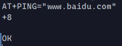

# 使用RISC-V固件的内核网络部署和维护方案

## 参赛信息

本项目参加2023全国大学生计算机系统能力大赛操作系统设计赛-功能挑战赛，选题为[proj140-RV-firmware-for-net](https://github.com/oscomp/proj140-RV-firmware-for-net)。

参赛小组：

- 北方工业大学 于新程 
- 北方工业大学 林达华

指导老师：

- 北方工业大学 宋丽华
- 北方工业大学 吴爱燕

## 目标描述

- 选择一块RISC-V开发板。编写或选用裸机的网络协议栈和网卡驱动，使其能在此开发板的M态收或发网络包。
- 选用合适的通讯协议，从文件服务器上下载内核文件。
- 部署下载好的内核到内存并启动此内核。 本题要求至少能下载和启动rCore-Tutorial级别的简单内核。

## 项目介绍及进度
1. 本项目选用M1W dock开发板，其搭载了k210芯片和esp8285 wifi模块，符合项目的需求。  
2. 在配置好项目相关环境后，修改`src/conncection.rs`中的wifi账号和密码，即可通过`make run BOARD=k210`命令来测试。
3. 目前，本项目已成功使用uart向wifi模块发送AT命令，使其连接上网络，并且初步搭建好了tcp传输协议栈
。正在学习如何使用smoltcp完成sftp协议，以便向服务器发送请求，接收rCore内核。  


## 仓库文件简介

- src/net/connection.rs:设置gpio、uart等，与wifi模块进行通信并联网
- src/net/dvc.rs:用于接收、发送数据包的接口
- src/net/tcp_connect.rs:通过smoltcp建立tcp的socket连接
- src/net/mod.rs:网络模块的主函数

<br>  

## 环境搭建
1. 安装rust nightly工具链
``` bash 
rustup install nightly
rustup default nightly
```
2. 安装一些Rust相关的软件包
```bash 
rustup target add riscv64gc-unknown-none-elf
cargo install cargo-binutils
rustup component add llvm-tools-preview
rustup component add rust-src
```
3. 上板烧录运行
```
cd net210
make run
```

# 具体设计

## 与wifi通信
M1W配有ESP8285模块，要让M1W与其通过uart进行通信，需要先通过fpioa进行引脚与功能端的配置。
本项目将WIFI_RX(pin7), WIFI_TX(pin6), WIFI_EN(pin8)，即wifi的接收端，传输段和使能端
与uart1_rx, uart1_tx和gpiohs8接通，同时配置好相关管脚使能，时钟频率等，即可向其发送AT命令进行控制。  
ESP8285配有flash，通过命令将要连接的ap的账号和密码配置好后，再次使用时可使用保存的配置进行自动连接。同时，AT语言还可以控制其去ping其他ip，来检查是否成功连接网络，下图为对baidu.com进行ping后返回的结果。  



## TCP协议栈
在与wifi成功连接之后，还可通过AT指令来获取、修改无线网卡的ip、mac地址和默认路由。获取到相应的ip和mac后，即可使用将相关数据进行smoltcp的tcp接口的设置。其接口还需要一个实现了Device trait的结构体，用于接收与发送数据包。再之后，就可以创建tcp的buffer来建立socket,通过socket和之前的设立的接口就可以建立与ip进行连接。

## 流程图与网络层次图
  
  